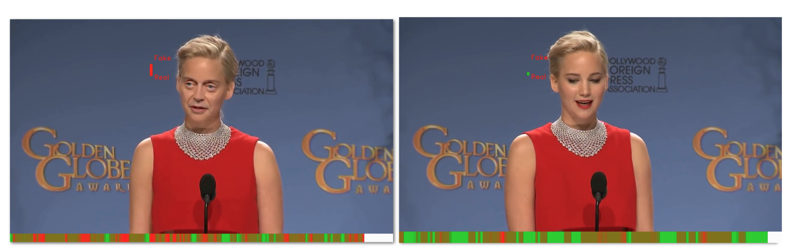

## Two-branch Recurrent Network for Isolating Deepfakes in Videos
&nbsp;&nbsp;&nbsp;&nbsp;&nbsp;&nbsp;&nbsp;&nbsp;&nbsp;&nbsp;
 

[](https://arxiv.org/pdf/2008.03412)

For method details, please refer to the [paper](https://arxiv.org/pdf/2008.03412), the [video presentation](https://www.youtube.com/watch?v=X3N8QjV15d8&feature=youtu.be), [demo of the system](https://www.youtube.com/watch?v=RspKj9DtM9U)


<sub> Deepfake detection in videos. The figure shows our system predic- tions when trained only on FaceForensics++ for a fake video “in the wild” (left) and its pristine video (right). The heatmap bar below the video indicates the likelihood of the video being fake (red) or unmanipulated (green).</sub>


### Videos and Results

<iframe width="500" height="280" src="https://www.youtube.com/embed/X3N8QjV15d8?controls=0" frameborder="0" allow="accelerometer; autoplay; clipboard-write; encrypted-media; gyroscope; picture-in-picture" allowfullscreen></iframe>
<br/>
<iframe width="500" height="280" src="https://www.youtube.com/embed/RspKj9DtM9U?controls=0" frameborder="0" allow="accelerometer; autoplay; clipboard-write; encrypted-media; gyroscope; picture-in-picture" allowfullscreen></iframe>
<br/>
<iframe width="500" height="280" src="https://www.youtube.com/embed/nbgkJAVyphs?controls=0" frameborder="0" allow="accelerometer; autoplay; clipboard-write; encrypted-media; gyroscope; picture-in-picture" allowfullscreen></iframe>
<br/>
<iframe width="500" height="280" src="https://www.youtube.com/embed/2e0KLUCXKlY?controls=0" frameborder="0" allow="accelerometer; autoplay; clipboard-write; encrypted-media; gyroscope; picture-in-picture" allowfullscreen></iframe>

<br/><br/>

If you find our paper useuful, please cite it as:

```latex
    @inproceedings{masi2020two,
    title={ Two-branch Recurrent Network for Isolating Deepfakes in Videos},
    author={Masi, Iacopo and Killekar, Aditya and Mascarenhas, Royston Marian and Gurudatt, Shenoy Pratik and AbdAlmageed, Wael},
    booktitle={European Conference on Computer Vision (ECCV)},
    year={2020}
}
```


### Contact
For any paper related questions, please contact `masi@isi.edu` or open a Github issues above. Please, note that we do not provide software support besides simply replying to a few questions. Thank you for your understanding.

### [License](LICENSE)
The Software is made available for academic or non-commercial purposes only. The license is for a copy of the program for an unlimited term. Individuals requesting a license for commercial use must pay for a commercial license.

    USC Stevens Institute for Innovation 
    University of Southern California 
    1150 S. Olive Street, Suite 2300 
    Los Angeles, CA 90115, USA 
    ATTN: Accounting 
 
DISCLAIMER. USC MAKES NO EXPRESS OR IMPLIED WARRANTIES, EITHER IN FACT OR BY OPERATION OF LAW, BY STATUTE OR OTHERWISE, AND USC SPECIFICALLY AND EXPRESSLY DISCLAIMS ANY EXPRESS OR IMPLIED WARRANTY OF MERCHANTABILITY OR FITNESS FOR A PARTICULAR PURPOSE, VALIDITY OF THE SOFTWARE OR ANY OTHER INTELLECTUAL PROPERTY RIGHTS OR NON-INFRINGEMENT OF THE INTELLECTUAL PROPERTY OR OTHER RIGHTS OF ANY THIRD PARTY. SOFTWARE IS MADE AVAILABLE AS-IS. LIMITATION OF LIABILITY. TO THE MAXIMUM EXTENT PERMITTED BY LAW, IN NO EVENT WILL USC BE LIABLE TO ANY USER OF THIS CODE FOR ANY INCIDENTAL, CONSEQUENTIAL, EXEMPLARY OR PUNITIVE DAMAGES OF ANY KIND, LOST GOODWILL, LOST PROFITS, LOST BUSINESS AND/OR ANY INDIRECT ECONOMIC DAMAGES WHATSOEVER, REGARDLESS OF WHETHER SUCH DAMAGES ARISE FROM CLAIMS BASED UPON CONTRACT, NEGLIGENCE, TORT (INCLUDING STRICT LIABILITY OR OTHER LEGAL THEORY), A BREACH OF ANY WARRANTY OR TERM OF THIS AGREEMENT, AND REGARDLESS OF WHETHER USC WAS ADVISED OR HAD REASON TO KNOW OF THE POSSIBILITY OF INCURRING SUCH DAMAGES IN ADVANCE.

For commercial license pricing and annual commercial update and support pricing, please contact:

 
    Nikolaus Traitler USC Stevens Institute for Innovation
    University of Southern California
    1150 S. Olive Street, Suite 2300
    Los Angeles, CA 90115, USA
 
    Tel: +1 213-821-3550
    Fax: +1 213-821-5001
    Email: traitler@usc.edu and cc to: accounting@stevens.usc.edu
