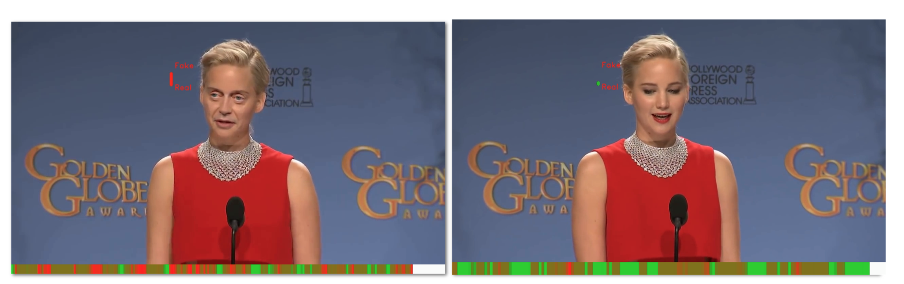

## Research 
I am a computer scientist and professor interested in solving the `computer vision problem`: giving machines the gift of observing the world through cameras (eyes) like humans do. 

In other words, interpret visual data so to turn numerical pixels into high-level semantics. I also sympathize with the [slow science movement](http://slow-science.org) when applied to science in computer vision and machine learning.

### Recent Research Spotlight
#### Enforcing smoothness for face segmentation

#### Isolating Deepfake videos

#### Deep Face Recognition Tutorial

